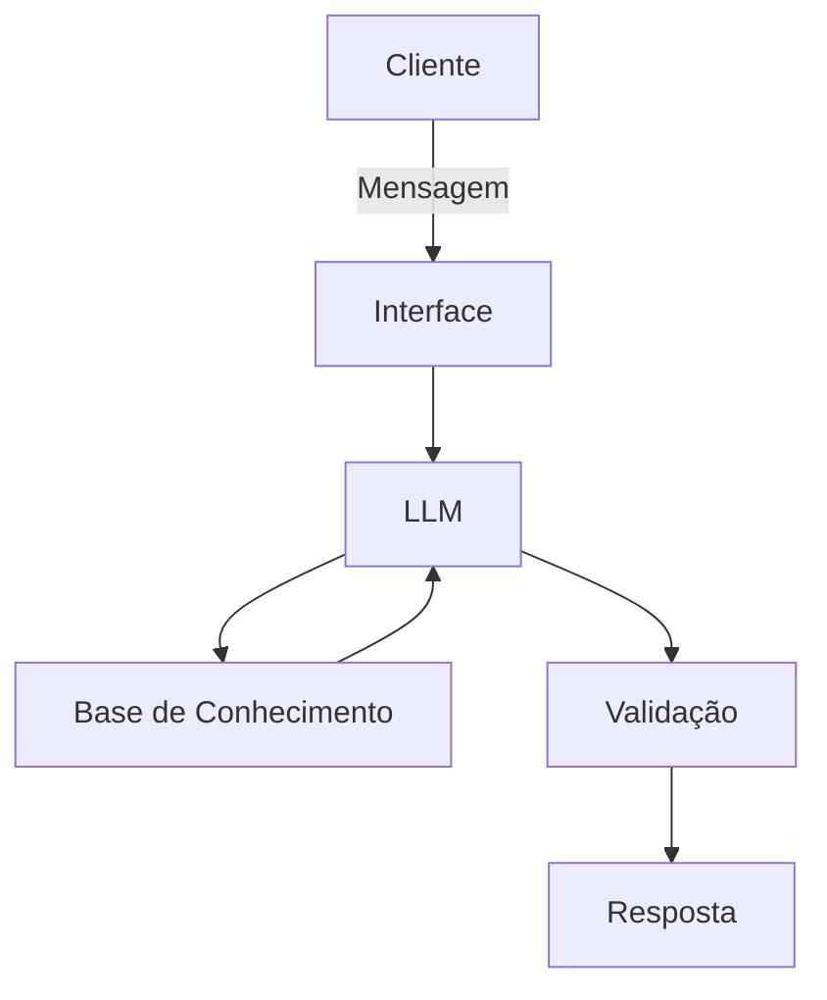

# 🤖 Salomão — Agente Educador Financeiro com IA Generativa

Solução desenvolvida para o desafio **DIO Lab: A Bia do Futuro**, propondo um agente de IA Generativa focado em **educação financeira**.

## Sobre o Salomão

Muita gente tem dificuldade em entender conceitos básicos de finanças pessoais — reserva de emergência, tipos de investimento, organização de gastos. O **Salomão** é um agente educativo que explica esses conceitos de forma simples, usando os dados do próprio cliente como exemplo prático, **sem nunca recomendar investimentos**.

- **Persona:** educador paciente e didático, tom informal e acessível — como um professor particular.
- **Público-alvo:** pessoas iniciantes em finanças que querem aprender a organizar sua vida financeira.

## Arquitetura

| Componente | Descrição |
|---|---|
| Interface | Streamlit |
| LLM | Ollama (local) |
| Base de Conhecimento | JSON/CSV com dados do cliente |

## Segurança e Anti-Alucinação

- Responde apenas com base nos dados fornecidos no contexto.
- Admite quando não sabe algo, em vez de inventar respostas.
- Nunca recomenda investimentos — apenas explica como funcionam.
- Não acessa dados sensíveis (senhas etc.) nem substitui um profissional certificado.

## Base de Conhecimento

O agente usa os dados mockados da pasta [`data/`](./data/) para contextualizar e personalizar as explicações:

| Arquivo | Uso no Salomão |
|---|---|
| `perfil_investidor.json` | Personalizar explicações conforme o perfil do cliente |
| `transacoes.csv` | Analisar padrões de gastos de forma didática |
| `historico_atendimento.csv` | Dar continuidade a interações anteriores |
| `produtos_financeiros.json` | Ensinar sobre produtos disponíveis |

> O produto "Fundo Multimercado" foi substituído por "Fundo Imobiliário (FII)" para validar as respostas com mais segurança.

## Prompts

O comportamento do Salomão é guiado por um system prompt com regras claras (nunca recomendar investimentos, usar linguagem simples, admitir limitações) e exemplos de few-shot prompting para tratar perguntas comuns e casos-limite, como perguntas fora do escopo ou pedidos de dados sensíveis.

## Documentação completa

| Etapa | Arquivo |
|---|---|
| Caso de uso, persona e arquitetura | [`docs/01-documentacao-agente.md`](./docs/01-documentacao-agente.md) |
| Base de conhecimento | [`docs/02-base-conhecimento.md`](./docs/02-base-conhecimento.md) |
| Prompts do agente | [`docs/03-prompts.md`](./docs/03-prompts.md) |

---

Baseado no template do desafio [DIO Lab: Bia do Futuro](https://github.com/digitalinnovationone/dio-lab-bia-do-futuro).
